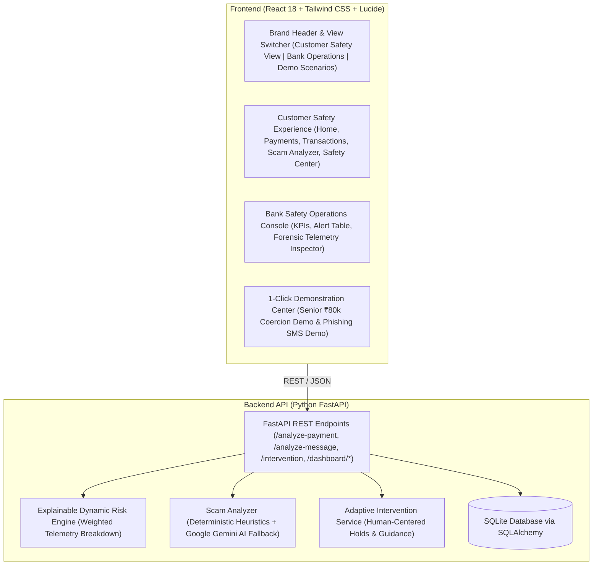

# GuardianPay AI 🛡️
> **"Detect. Warn. Protect."**  
> *A Digital-Banking Financial Safety Layer Protecting Vulnerable Customers from Digital Fraud & Social Engineering Manipulation.*  
> **Built for Innovation Unbound Hackathon @ VIT Chennai**

---

## 📌 Demonstration Disclaimer
> [!IMPORTANT]
> **DEMONSTRATION PROTOTYPE SANDBOX**  
> GuardianPay AI does **NOT** connect to real bank accounts, real UPI networks, real payment gateways, or live customer financial records. All customer personas, balances, transactions, and banking identifiers are **100% synthetic**.

---

## 🌟 1. Core Problem & Product Philosophy

### The Real Banking Problem:
Digital banking adoption is accelerating rapidly, but **senior citizens, first-time digital banking users, and digitally inexperienced individuals** remain disproportionately vulnerable to social engineering scams:
- Fake bank KYC expiration threats via SMS.
- Electricity bill disconnection panic calls.
- Deceptive callers directing victims to download remote screen-sharing tools (*AnyDesk / TeamViewer*).
- Coercive pressure forcing customers to authorize transfers to fraudulent beneficiary accounts.

### The Paradigm Shift:
```
Traditional Fraud Systems    ───►  "Is this transaction credential fake or stolen?"
GuardianPay AI Prevention    ───►  "Is the legitimate customer being manipulated into making this payment?"
```

Traditional fraud detection tools only evaluate if credentials or tokens were stolen. When a panic-stricken customer is coerced into sending money willingly, traditional tools fail.

**GuardianPay AI intervenes BEFORE money leaves the account.** It calculates multi-factor behavioral risk, displays transparent reasons, and executes the signature **Manipulation Check**:
> **"Did someone ask you to make this payment urgently?"**
> - 🛑 **"YES"** ➔ **HOLD & VERIFY** (Payment paused safely, funds remain in the account, clear guidance provided).
> - ⚡ **"NO"** ➔ Verification completed and payment processed.
> - ❓ **"I'M NOT SURE"** ➔ Payment paused safely for independent verification.

---

## 🏗️ 2. System Architecture



---

## 📁 3. Folder Structure

```
GuardianPay AI/
├── backend/
│   ├── app/
│   │   ├── api/
│   │   │   ├── customers.py        # Customer profile & baseline querying
│   │   │   ├── transactions.py     # Payment analysis & transaction creation
│   │   │   ├── scam.py             # Scam message & phishing analyzer
│   │   │   ├── dashboard.py        # Bank monitoring stats & alert queue
│   │   │   ├── intervention.py     # Adaptive questionnaire response handler
│   │   │   └── demo.py             # 1-Click hackathon demo scenario presets
│   │   ├── database/
│   │   │   ├── database.py         # SQLAlchemy engine & session maker
│   │   │   ├── models.py           # Customer, Beneficiary, Transaction, RiskResult, ScamAnalysis models
│   │   │   └── seed.py             # Realistic synthetic data seeder
│   │   ├── schemas/                # Pydantic validation schemas
│   │   │   ├── customer.py
│   │   │   ├── transaction.py
│   │   │   ├── scam.py
│   │   │   ├── dashboard.py
│   │   │   └── intervention.py
│   │   ├── services/
│   │   │   ├── risk_engine.py      # Dynamic 0-100 explainable scoring engine
│   │   │   ├── scam_analyzer.py    # Deterministic phishing pattern detector
│   │   │   ├── gemini_service.py   # Google Gemini AI contextual analysis + local fallback
│   │   │   └── intervention_service.py # Adaptive hold & guidance processor
│   │   ├── utils/
│   │   │   └── helpers.py          # Currency & time formatting utilities
│   │   ├── config.py               # Settings & risk weights configuration
│   │   └── main.py                 # FastAPI application root & CORS setup
│   ├── requirements.txt            # Python dependencies
│   ├── test_backend.py             # Automated test suite
│   ├── .env.example                # Environment variables template
│   └── .env                        # Local configuration
├── frontend/
│   ├── src/
│   │   ├── components/
│   │   │   ├── common/
│   │   │   │   └── Header.jsx              # Navbar, Sandbox banner, Persona selector
│   │   │   ├── customer/
│   │   │   │   ├── CustomerNavigation.jsx  # Customer tab navigation
│   │   │   │   ├── CustomerDashboard.jsx   # Balance, Safety status, Recent activity
│   │   │   │   ├── SendMoney.jsx           # Clean payment form + telemetry simulator
│   │   │   │   ├── PaymentAnalysisModal.jsx# Payment Safety Check & Manipulation Check
│   │   │   │   ├── ScamAnalyzer.jsx        # Structured Security Assessment Report
│   │   │   │   ├── TransactionsView.jsx    # Transaction audit history
│   │   │   │   ├── BeneficiariesView.jsx   # Trusted contact directory
│   │   │   │   └── SafetyCenterView.jsx    # Emergency pause & senior safety tips
│   │   │   ├── bank/
│   │   │   │   ├── BankDashboard.jsx       # Fraud Operations Console (KPIs, Alert Table)
│   │   │   │   └── AlertDetailModal.jsx    # Forensic telemetry review & decision controls
│   │   │   └── demo/
│   │   │       └── DemoScenariosView.jsx   # 1-Click Guided Showcase for judges
│   │   ├── context/
│   │   │   └── AppContext.jsx              # Global React state management
│   │   ├── services/
│   │   │   └── api.js                      # REST client for backend communication
│   │   ├── App.jsx                         # Main application layout
│   │   ├── main.jsx                        # React root entry
│   │   └── index.css                       # Clean enterprise fintech styling
│   ├── package.json                        # Frontend dependencies (React, Lucide, Tailwind)
│   ├── vite.config.js                      # Vite configuration
│   └── tailwind.config.js                  # Enterprise color palette
├── run_backend.bat                         # 1-Click Windows backend launcher
├── run_frontend.bat                        # 1-Click Windows frontend launcher
└── README.md                               # Project documentation
```

---

## 🧮 4. Explainable Risk Engine Formula

$$\text{Risk Score} = \min(100, \sum \text{Triggered Factors})$$

| Telemetry Factor | Max Weight | Logic / Anomaly Trigger |
| :--- | :---: | :--- |
| **Transaction Amount Anomaly** | **+25** | Triggered when amount is significantly higher than customer's habitual maximum (e.g. ₹80,000 vs ₹5,000 typical limit). |
| **Beneficiary Familiarity** | **+20** | Triggered when recipient UPI ID is not in the customer's saved trusted beneficiaries list. |
| **Device Fingerprint** | **+20** | Triggered when payment is initiated from an unrecognized hardware device or new browser session. |
| **Temporal & Hour Analysis** | **+10** | Triggered when payment occurs outside normal active hours (e.g. 11:45 PM night transaction). |
| **Behavioral Velocity & Haste** | **+15** | Triggered when rapid multi-step transfer pattern indicates panic or external coaching. |
| **Threat Intelligence Link** | **+10** | Triggered when customer session is linked to recent phishing SMS or scam message analysis. |

### Risk Tiers & Adaptive Actions:
- **0 – 30 (LOW)** ➔ `ALLOW`: Standard safe execution.
- **31 – 60 (MEDIUM)** ➔ `WARN`: Subtle cautionary prompt.
- **61 – 80 (HIGH)** ➔ `VERIFY`: Elevated verification prompt.
- **81 – 100 (CRITICAL)** ➔ `HOLD & VERIFY`: Triggers the signature **Manipulation Check** *"Did someone ask you to make this payment urgently?"*.

---

## 🚀 5. How to Start the Project (Exact Commands)

### Step 1: Start Backend (Port 8000)
```bash
cd backend
python -m pip install -r requirements.txt
python -m uvicorn app.main:app --host 127.0.0.1 --port 8000 --reload
```
- API Endpoint: `http://127.0.0.1:8000`
- Swagger Interactive Documentation: `http://127.0.0.1:8000/docs`

### Step 2: Start Frontend (Port 5173)
```bash
cd frontend
npm install
npm run dev
```
- Application is live at: `http://127.0.0.1:5173`

*(On Windows, you can also double-click [`run_backend.bat`](file:///c:/Users/steve/OneDrive/Desktop/GuardianPay%20AI/run_backend.bat) and [`run_frontend.bat`](file:///c:/Users/steve/OneDrive/Desktop/GuardianPay%20AI/run_frontend.bat).)*

---

## 🧪 6. Automated Testing
```bash
cd backend
python test_backend.py
```
Expected output:
```
[PASS] Fraud Prevention Risk Score: 100 (CRITICAL) - Action: HOLD & VERIFY
[PASS] Scam Analysis Risk Score: 75% (HIGH) - Source: LOCAL_RULE_ENGINE
[PASS] Intervention Hold Result: HELD - Headline: Payment Paused for Your Protection
[PASS] Bank Dashboard Stats & Alerts loaded successfully.
==========================================
SUCCESS: ALL GUARDIANPAY AI TESTS PASSED!
==========================================
```

---

## 🎤 7. Demonstration Script for Hackathon Judges

```
[0:00 - 0:30] "Hello Judges, this is GuardianPay AI: Detect. Warn. Protect. 
Built for Innovation Unbound at VIT Chennai to solve a critical issue: 
Protecting vulnerable digital banking users—especially senior citizens—from digital financial fraud."

[0:30 - 1:00] "Traditional banking fraud systems ask: 'Is this transaction credential stolen?' 
They fail completely when a panic-stricken senior citizen is coerced into making the payment themselves.
GuardianPay AI makes the paradigm shift: 'Is the customer being manipulated?'"

[1:00 - 2:00] "Let's demonstrate Scenario 1 with Ravi Sharma, a 68-year-old beginner user. 
He receives a fake KYC SMS and attempts to send ₹80,000 to an unknown fraudster on a new device.
GuardianPay's explainable risk engine scores this as 100 CRITICAL risk and pauses.
Instead of showing scary error codes, it shows a clean Payment Safety Check and asks:
'Did someone ask you to make this payment urgently?'
When Ravi clicks 'YES', GuardianPay safely holds the payment BEFORE money leaves the account."

[2:00 - 2:30] "In our Scam Analyzer, seniors can paste any suspicious SMS or WhatsApp forward. 
The system formats it as a clear Security Assessment Report with identified warning signs and action advice."

[2:30 - 3:00] "On the Bank Operations side, fraud analysts gain real-time visibility into held funds, 
prevented fraud amounts (over ₹8,45,000), event timelines, and decision controls (Approve / Hold / Escalate).
GuardianPay AI moves digital banking from reactive fraud detection to proactive fraud prevention."
```

---

**GuardianPay AI** — *Detect. Warn. Protect.*  
*Innovation Unbound @ VIT Chennai*
